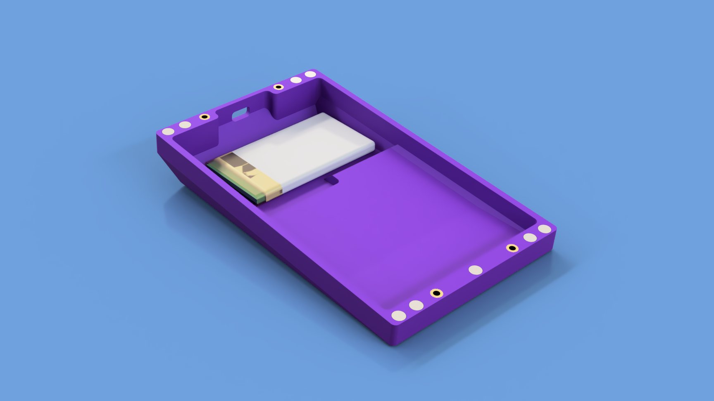

# NumBLE Wireless Numpad

NumBLE is a Bluetooth numpad with 3D printed case, based on the
[Nordic nNRF52840 SoC](https://www.nordicsemi.com/Products/Low-power-short-range-wireless/nRF52840).
It supports 21-key, 22-key, and 24-key layouts, and the top-left key can be
replaced with a rotary encoder. It is powered by up to an 1200 mAh Li-Po battery
and supports USB-C for charging and wired operation.

This is a DIY project and is not currently sold anywhere.
[Check the wiki](https://github.com/joelspadin/NumBLE/wiki) for instructions on
how to build one.

## Hardware

The PCB is hand-solderable, though it uses many small parts which are difficult
to solder by hand. It supports an optional fuel gauge IC, which provides more
accurate battery status but requires reflow soldering. The [pcb folder](pcb)
contains a [KiCad](https://www.kicad.org/) project (requires KiCad 5.99 nightly
builds).

The [case folder](case) contains the design files for the case and plate. The
case is 3D printed in two parts, and the plate is attached to the bottom with
four bolts into threaded inserts. The top attaches to the bottom with magnets
glued into both halves.

Removing the top of the case exposes power and reset switches. The power switch
only affects the numpad when in wireless mode. When wired, it is always powered
and will charge the battery regardless of the position of the power switch.

## Software

NumBLE runs [ZMK Firmware](https://zmkfirmware.dev/). The [zmk-config folder](zmk-config)
holds the source files for the firmware. To customize the keymap, fork this repo
and edit [numble.keymap](zmk-config/boards/arm/numble/numble.keymap).
After pushing changes to GitHub, it will automatically build the new firmware
for you. Check the "Actions" tab above for the build results.

The bootloader is built with [my fork of Adafruit's nRF52 bootloader](https://github.com/joelspadin/Adafruit_nRF52_Bootloader).

There are other firmwares that can run on an nRF52, and I will be happy to
answer questions on setting them up for NumBLE, but I do not plan to personally
support them.

The bootloader included in the releases does not contain the SoftDevice, as
Zephyr does not need it. If you'd like to run firmware that requires the
SoftDevice, you can either compile the bootloader yourself, or let me know and I
can include multiple versions of the bootloader in releases.

## Status

Some parts of the hardware have not yet been fully tested.

| Feature                           | Status                                                  |
| --------------------------------- | ------------------------------------------------------- |
| 21-key layout                     | Working                                                 |
| 22-key layout                     | Untested                                                |
| 24-key layout                     | Untested                                                |
| Encoder                           | Untested                                                |
| Battery reporting with fuel gauge | Partially tested, requires driver updates in Zephyr 2.6 |
| Voltage-based battery reporting   | Software work in progress                               |

## More Renders

## Credits

The case was designed with [Fusion 360](https://www.autodesk.com/products/fusion-360).
Renders use the [Interior HDRI free pack](https://www.maximeroz.com/hdri-free-pack)
by Maxime Roz.

The KiCAD project uses symbols and footprints from:

- [ai03-2725/MX_Alps_Hybrid](https://github.com/ai03-2725/MX_Alps_Hybrid)
- [ai03-2725/Type-C.pretty](https://github.com/ai03-2725/Type-C.pretty)
- [joric/nrfmicro](https://github.com/joric/nrfmicro)
